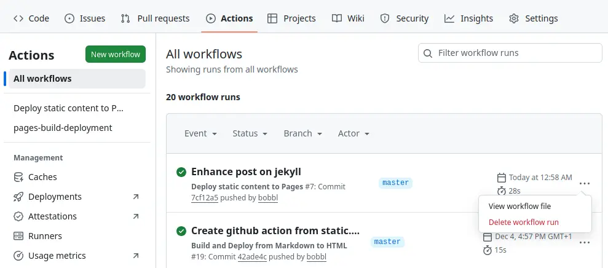

After reading Fabien Sanglard's blog post about
[bloated](https://fabiensanglard.net/bloated/index.html) websites, I realised
that I am guilty, too. Using [Jekyll](https://jekyllrb.com/) for building my
little blog implies unnecessary dependencies and waste of computing power.
A simple shell script and [Pandoc](https://pandoc.org/) for converting the
markdown should do the job.
And there are several projects like [Arise](https://ari.se.net/),
[bashblog](https://github.com/cfenollosa/bashblog) or [bic](https://bic.sh/)
that use bash to create static blog websites from markdown. However,
in my opinion configuring them is more work that writing such
a script from scratch. And I prefer pure POSIX shell scripting over bash
(the b stands for bloated).

What the generator script does
------------------------------

The script recursively descents the `src/` directory and copies the whole tree
with all files to the `dist/` directory. Only markdown files (extension `.md`)
get a special treatment: They are converted to HMTL with Pandoc and a header
and footer in pure HTML are added. To be precise, the relative `href=` 
references in the header and footer have to be adjusted to the directory depth
and there is a little postprocessing to set the title of the HTML page
according to the `title:` tag in the frontmatter of the markdown file (Pandoc
cannot do this).

If the frontmatter contains a `date: YYYY-MM-DD` tag or the file path contains
a date in the form `YYYY-MM-DD`, the page is treated as a blog post and added to
the list of blog posts. At the end a page with this list, ordered by date is
generated. That's all.

This gives maximum flexibility:

  * Any directory structure is possible.
  * Arbitrary HTML pages can be added (they are simply copied).
  * The markdown posts can be placed anywhere within the directory structure.

Legacy Jekyll links
-------------------

Since postings can be put anywhere in the directory tree, it is easy to preserve
the URLs of the deprecated Jekyll pages. You just have to create enough
subdirectories and put your markdown file there. The script will find them and
order them by date automatically 

But I want that even my old posts are in the new directory structure which is
ordered by date. Therefore I added redirects using the
`<meta http-equiv="refresh">` tag:

    <!DOCTYPE html>
    <html lang="en">
      <head>
        <meta http-equiv="refresh" content="0; url=https://bobbl.github.io/NEWURL">
        <title>Redirection</title>
      </head>
      <body>
        

          The page has moved to
          <a href="https://bobbl.github.io/NEWURL">
                   https://bobbl.github.io/NEWURL
          </a>. You will be automatically redirected.
        

      </body>
    </html>

Create GitHub action
--------------------

GitHub actions are created by putting a YAML scripts in `.github/workflows/`.
Several internet sources recommend to use 
[peaceiris/actions-gh-pages@v4](https://github.com/peaceiris/actions-gh-pages)
to deploy static HTML files to GitHub. So I modified one of the proposed
YAML files to fit my needs. But it didn't work. My build script was executed
and the generated files where pushed to the branch `gh-pages`, but they were
not deployed to my GitHib page <http://bobbl.github.io>.

Therefore I choose another way: modify an action suggested by GitHub. To get
this script, you have to delete the last run of a workflow. This can be done
by navigationg in the GitHub web interface to `Actions` and remove the topmost
workflow runs by clicking on the three dots and choosing `Delete workflow run`.

Then go to `Settings > Pages > Build and deployment > Source` and choose
`GitHub Actions`.

Click on `Static HTML > Configure` and edit the suggested `static.yml`.

Replace the setup step

    - name: Setup Pages
      uses: actions/configure.pages@v5

by two steps to install Pandoc and run the build script

    - name: Install Pandoc
      uses: pandoc/actions/setup@v1
    - name: Build HTML from Markdown
      run: ./make.sh build

Finally, the path to the HTML files must be set to `dist`:

    path: './dist'

The complete workflow file looks like this (some comments removed, download
with all comments [here](https://github.com/bobbl/bobbl.github.io/blob/master/.github/workflows/static.yml))

    # Simple workflow for deploying static content to GitHub Pages
    name: Deploy static content to Pages

    on:
      # Runs on pushes targeting the default branch
      push:
        branches: ["master"]

      # Allows you to run this workflow manually from the Actions tab
      workflow_dispatch:

    # Sets permissions of the GITHUB_TOKEN to allow deployment to GitHub Pages
    permissions:
      contents: read
      pages: write
      id-token: write

    # Allow only one concurrent deployment
    concurrency:
      group: "pages"
      cancel-in-progress: false

    jobs:
      # Single deploy job since we're just deploying
      deploy:
        environment:
          name: github-pages
          url: ${{ steps.deployment.outputs.page_url }}
        runs-on: ubuntu-latest
        steps:
          - name: Checkout
            uses: actions/checkout@v4

          - name: Install Pandoc
            uses: pandoc/actions/setup@v1
          - name: Build HTML from Markdown
            run: ./make.sh build

          - name: Upload artifact
            uses: actions/upload-pages-artifact@v3
            with:
              path: './dist'
          - name: Deploy to GitHub Pages
            id: deployment
            uses: actions/deploy-pages@v4

Disable Jekyll
--------------

There are different suggestions on how to disable Jekyll:

   * Create empty `.nojekyll` file in the root directory
   * Create empty `.nojekyll` file and in the `dist/` directory.
   * Remove all Jekyll files (`Gemfile`, `Gemfile.lock`, `config.yml`, 
     `_posts/`, ...)
   * Removed all workflow runs from the `Action` tab in the GitHub web 
     interface. (see screenshot above)

I don't know, what really works or if any of these steps is necessary at all.

